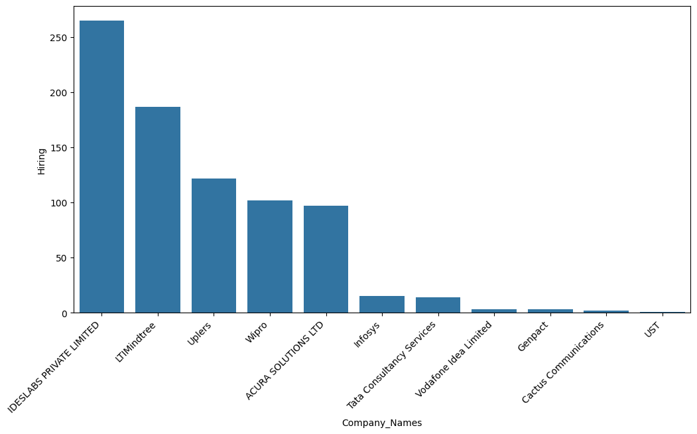

#  LinkedIn Job Market Analysis 2023 (India)

This project analyzes LinkedIn job postings from 2023 focused on the Indian job market. It uncovers the most in-demand job titles, hiring companies, required skills, and location-based demand for key tech skills.

---

##  Key Objectives

- Identify the **Top 10 Most In-Demand Job Titles**
- Find the **Top 10 Most Active Hiring Companies**
- Analyze the **Most Demanded Tech Skills**
- Discover **Top Hiring Locations** for each key skill (AI, ML, ReactJS, etc.)

---

##  Dataset Overview

The dataset was sourced from Kaggle, based on LinkedIn job posts in India during 2023.  
Key columns included:

- `Company_Name`
- `Designation`
- `Location`
- `Total_applicants`
- `LinkedIn_Followers`
- `Level`
- `Employee_count`
- `Industry`
- Skills: `AI`, `ML`, `REACTJS`, `HTML`, `TABLEAU`, `NODEJS`, `EXCEL`, `POWER BI`, `SELENIUM`

---

##  Insights & Visuals

###  Top 10 In-demand Job Titles
These are the roles that had the highest number of listings on LinkedIn India in 2023.

---

###  Top 10 Most Hiring Companies
Companies with the highest number of job postings.

---

###  Most Demanded Tech Skills
These skills appeared most frequently across all job postings.

---

### Top Hiring Locations per Skill
Skill-based demand distribution across different Indian cities.

---

##  Tech Stack

- **Python**
  - `pandas` for data manipulation
  - `matplotlib` and `seaborn` for visualizations
- **Jupyter Notebook** for analysis
- **Git & GitHub** for version control

---

##  Folder Structure

